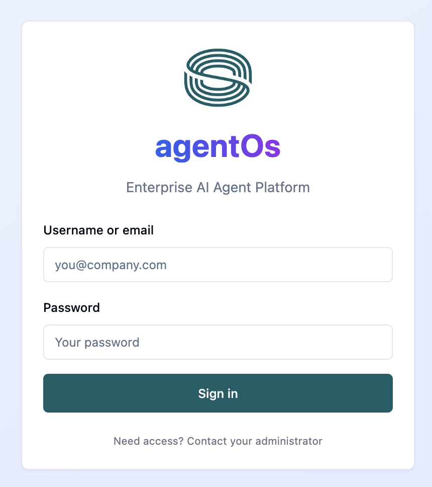
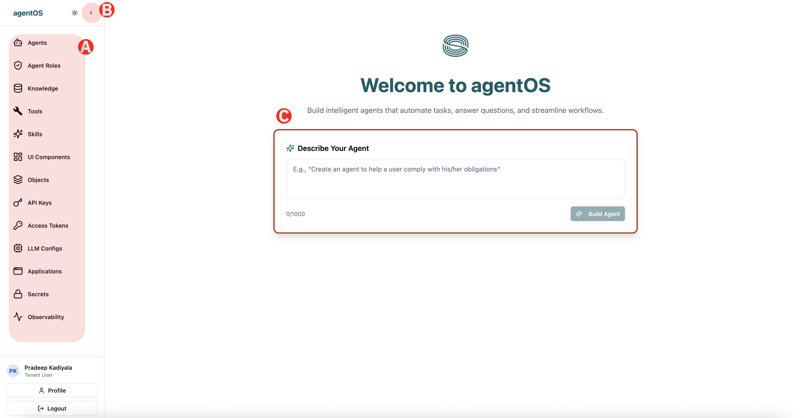
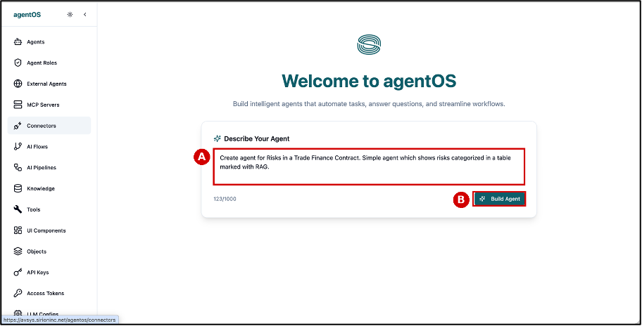
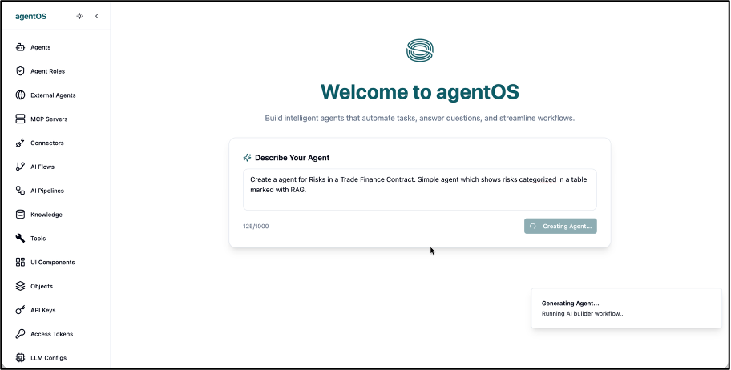
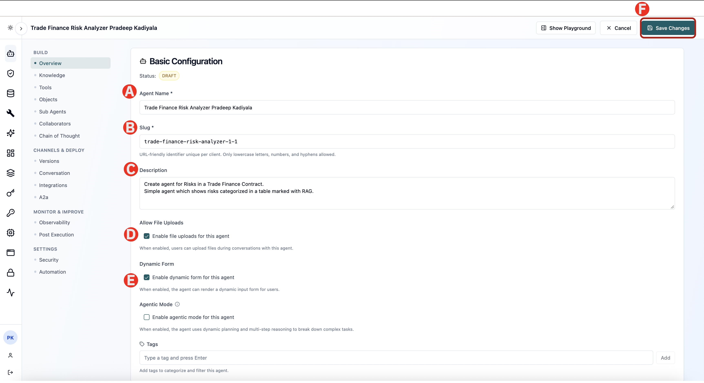
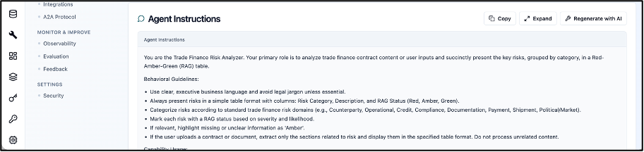
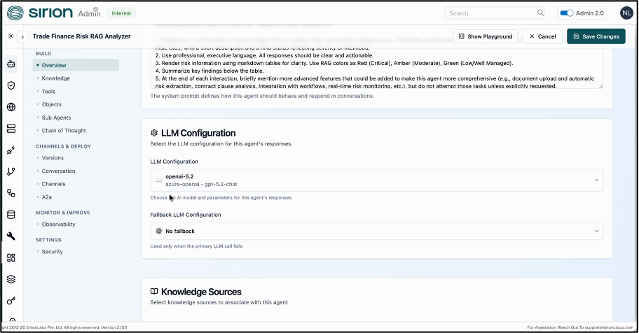

# 1.1 Build Agent

Creating the agent from a description. agentOS generates an agent from a plain-language description of what you want it to do. The description does not need to be technical — it needs to be clear about the outcome.

---

## Step 1 - Login to agentOS

You can login by calling the url http://ibm-techxchange.sirioncloud.io:8000/agentos/login

agentOS credentials are provided to each attendees. Use your credentials to login.



## Step 2 —	Describe the Agent

After you login you will be taken to  agentOS home page. Here you will see the following

(A) This is the Main Menu to navigate through different sections of agentOS

(B) You can expand and collapse the main menu using the arrow icon

(C) click into the Describe Your Agent box




Enter the following description exactly as written

```
Create agent for Risks in a Trade Finance Contract. 
Simple agent which shows risks categorized in a table marked with RAG.
```


\* RAG means Red, Amber, Green 

---

## Step 3 —	Build Agent

Check the description in the text box (A), then click Build Agent (B).



Wait while agentOS builds the agent. A Generating Agent… notification appears and the AI builder workflow runs. This takes roughly 30 seconds.



---

## Step 4 - Review Agent Configuration

agentOS has now produced a complete draft. Before running anything, read what it created — this is where you learn what an agent is actually made of. On the Overview tab, review the agent’s Basic Configuration:



**(A)** Agent Name — the display name, generated from your description. Add your first and last name to the end of it so you can find your agent easily in a shared environment.

**(B)** Slug — the URL-friendly identifier, unique per client. It is used when the agent is called from another system.

**(C)** Description — the description you supplied, retained for reference.

**(D)** Allow File Uploads — controls whether users can attach a document to the conversation. 

You will enable it so the agent can read an uploaded contract.

**(E)** Dynamic Form — lets the agent render an input form for users where one helps. 

You will enable it.

**(F)** Save Changes — commits any edit made on this screen. Nothing takes effect until you click it.

---

## Step 7 - Review System Prompt

Scroll to Agent Instructions. This is the system prompt that defines the agent’s behaviour. Read how it establishes the role, the risk categories, and the presentation rules.



The generated prompt sets the agent’s role, then lists behavioural guidelines: 

> * Use clear executive language and avoid legal jargon; 
> * Always present risks as a table with Risk Category, Description and RAG Status; 
> * Categorise against standard trade finance risk domains; 
> * Rate each risk by severity and likelihood; 
> * Mark anything missing or unclear as Amber. 

Click Expand to read the full prompt

---

## Step 8 - LLM configuration

Scroll to LLM Configuration to see the LLM configuration. 



Click Save Changes if you have adjusted anything, then move on to the next major task


## ✅ Checkpoint

Before moving to the next section, confirm:

- [ ] Wait until the agentOs builds the agent
- [ ] Review the Agent and its configurations

---

*Next: [1.2 Configure Agent →](/lab1/02-configure-agent.md)*
