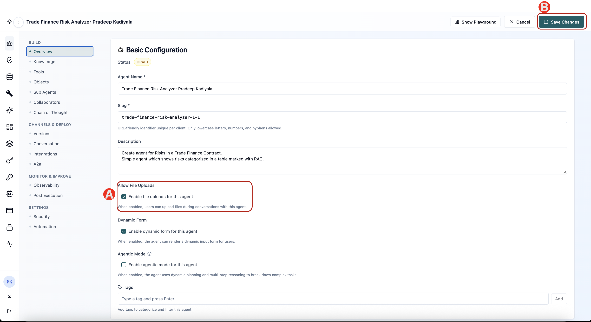
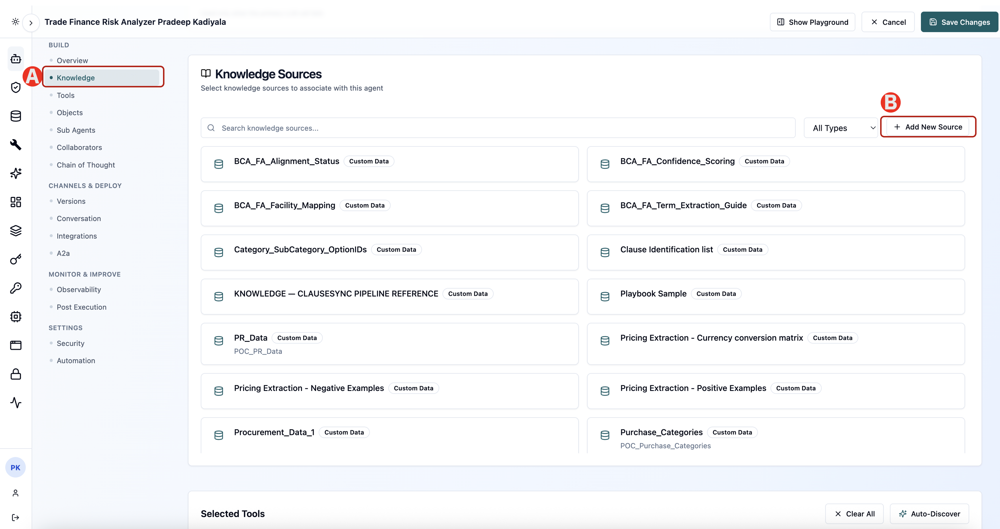
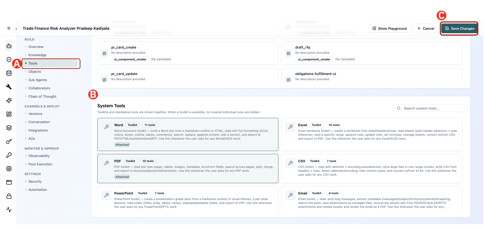

# 1.2 Configure Agent

The agent exists, but it cannot yet read a document. In this task you give it the tools to do so, shape the experience a business user sees with greetings and conversation starters, and then run a real contract through it.

Tools are what let an agent act rather than just talk. To read an uploaded contract, this agent needs the document toolkits.

## Step 1 - Enable file uploads

First, let the agent accept a document. On the Overview tab, make sure "Allow File Uploads" is enabled. 

If its not enabled, 

(A) click the check box to enable 

(B) click Save Changes

 set Allow File Uploads to enabled and click Save Changes. Without this the agent has no way to receive the contract.




## Step 2 -	Knowledge Source Update

This step is only to know how to update knowledge source but is not needed for this lab

In the left rail of the agent, under BUILD, 

(A) click Knowledge and review the Knowledge Sources panel. 

(B) Add New Source will let you add new knowledge from sources with source types available — Website, Document and Custom Data. (Do not do anything here)




## Step 3 - Attach Tools

(A) Click Tools in the left rail. 

(B) Scroll to System Tools (which is below UI Components) — these are the toolkits agentOS provides out of the box.

Select Word, PDF, Document Parser. 

> You need to scroll inside the System Tools to find Document Parser 

(C) Click Save Changes. A confirmation message appears when the agent has been updated.




> Why these tools? The sample contract is a Word document. Without a toolkit that can open it, the agent has nothing to analyse. Adding the PDF toolkit means the same agent also handles PDF contracts without further configuration.

---

## Step 4 - Update Greetings and Conversation starters 

What a business user sees first determines whether they use the agent at all. The Conversation section controls the greeting and the suggested prompts.


(A) In the left rail, under CHANNELS & DEPLOY, click Conversation.

(B) In Greeting message, enter the message users see when they open the agent:

```text
Welcome! I can show you the key risks in a trade finance contract, categorized and color-coded by severity (RAG). How can I assist you today?
```

Under Conversation starters, add the following prompts. These give a new user somewhere obvious to begin:

```text 
Show me a standard RAG risk table for trade finance contracts. 
```

```text 
What are the top risks in a letter of credit agreement?
```

```text 
Explain the difference between credit and performance risk in trade finance.
```

```text 
How can I extend this agent to analyze uploaded contracts automatically?
```

(C) Click Save Changes


> **TIP:** Conversation starters are the cheapest way to make an agent feel useful. Write them as the questions your users actually ask, not as descriptions of what the agent can do.

---

## ✅ Checkpoint

- [ ] Attached Tools
- [ ] Update the conversation configurations
- [ ] Save the changes

---

*Next: [Lab 2 — Run the analysis and read the dashboard →](../lab1/03-run.md)*
