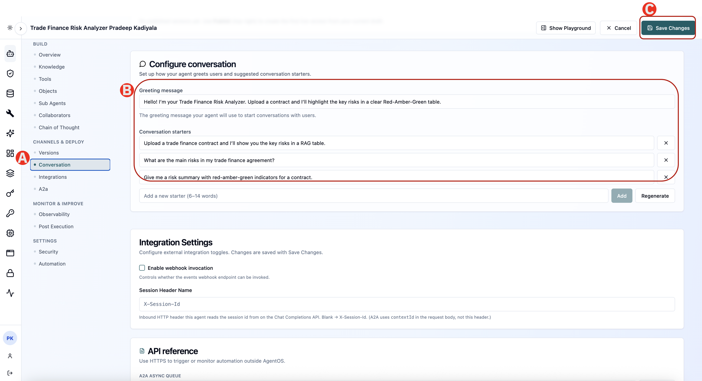

# 1.3 Configuring conversation experience

What a business user sees first determines whether they use the agent at all. The Conversation section controls the greeting and the suggested prompts.

---

## Update Greetings and Conversation starters 



(A) In the left rail, under CHANNELS & DEPLOY, click Conversation.

(B) In Greeting message, enter the message users see when they open the agent:

```text
Welcome! I can show you the key risks in a trade finance contract, categorized and color-coded by severity (RAG). How can I assist you today?
```

Under Conversation starters, add the following prompts. These give a new user somewhere obvious to begin:

```text 
Show me a standard RAG risk table for trade finance contracts. 
```

```text 
What are the top risks in a letter of credit agreement?
```

```text 
Explain the difference between credit and performance risk in trade finance.
```

```text 
How can I extend this agent to analyze uploaded contracts automatically?
```

(C) Click Save Changes


> **TIP:** Conversation starters are the cheapest way to make an agent feel useful. Write them as the questions your users actually ask, not as descriptions of what the agent can do.

---

## ✅ Checkpoint

- [ ] Update the conversation configurations
- [ ] Save the changes

---

*Next: [Lab 2 — Run the analysis and read the dashboard →](../lab1/04-run.md)*
