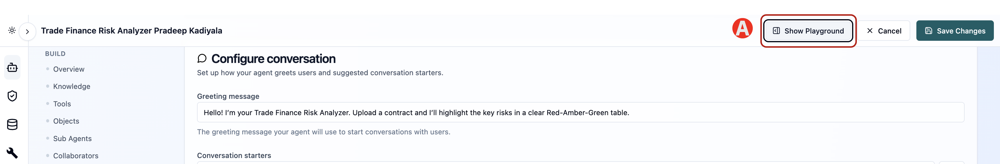
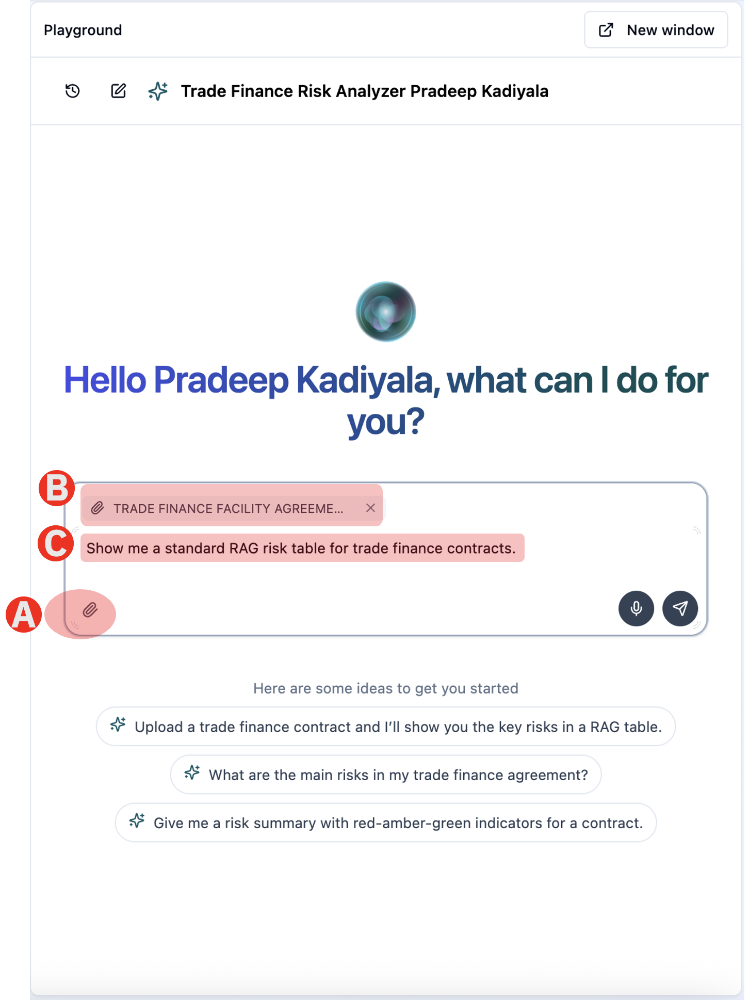
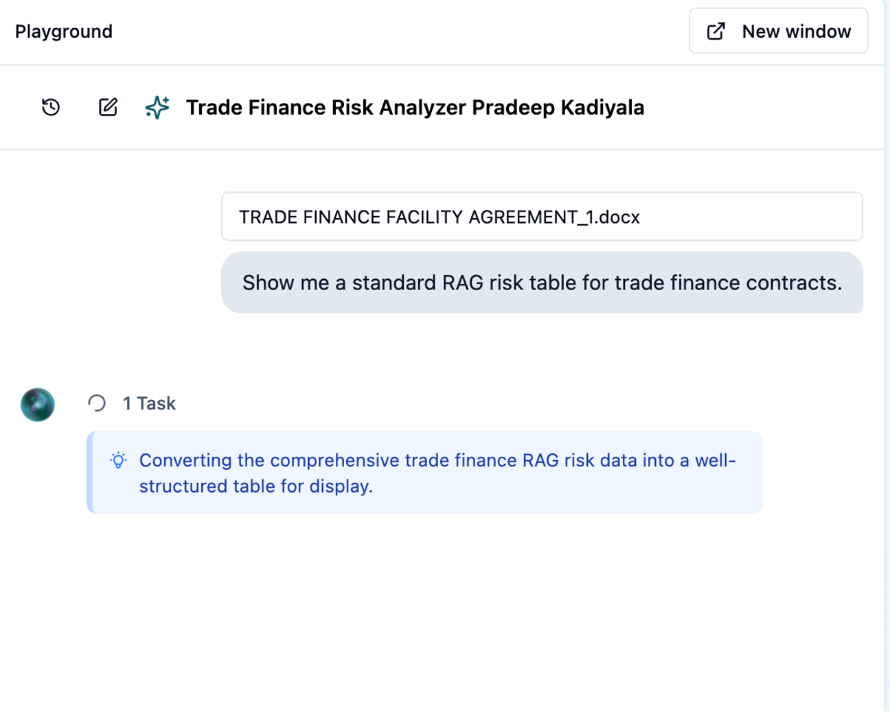
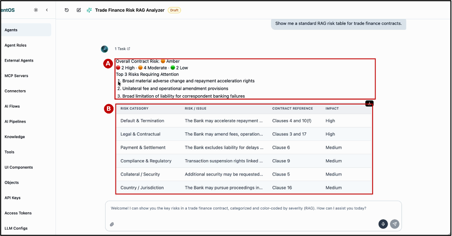

# 1.4 Run the Agent

Now run contract through the agent and read what comes back.

---

## Step 1 - Run the Agent in the playground

(A) Click Show Playground in the top right of the agent




The Playground opens beside the configuration so you can test without leaving the page. Your greeting and conversation starters appear exactly as a user would see them.


## Step 2 - Upload the "Trade Finance Contract" file

(A) Under Playground panel, click the attachment icon in the message box and upload TRADE FINANCE FACILITY AGREEMENT.docx. A copy of the contract is linked in Prerequisites of this guide

> DOWNLOAD FILE: You can also download the contract file from here [TRADE FINANCE FACILITY AGREEMENT.docx](/lab1/files/TRADE_FINANCE_FACILITY_AGREEMENT_1.docx ':ignore')

(B) The file is attched to the chat box once it is uploaded

(C) Enter the user prompt given below

```text
Show me a standard RAG risk table for trade finance contracts.
```



## Step 5 - View tasks running in the background

While it works, the agent shows the task it is performing — Reviewing the uploaded trade finance agreement to identify material contractual risks. Click one Task at any point to see what it is doing.



## Step 6 - Read the result

The agent returns an overall rating, a count of risks by severity, the top three risks requiring attention, and a table of risks with clause references.

(A) Executive summary — Overall Contract Risk, the count of High, Moderate and Low risks, and the top three risks requiring attention.

(B) Risk table — each risk with its category, the issue identified, the clause it comes from, and its impact.




Reading the RAG scale. The rating describes how urgently a risk needs attention, not how likely it is:

* Red — high-risk issue requiring immediate attention before signature.
* Amber — moderate risk or an issue that should be reviewed and, where possible, negotiated.
* Green — low or no material risk identified; the clause is acceptable as drafted.

---

Before moving to the next section, confirm:

- [ ] You are able to run the Agent
- [ ] Review the Agent response

*Next: [1.4 Implement Deterministic UI →](lab1/04-deterministic-ui.md)*


