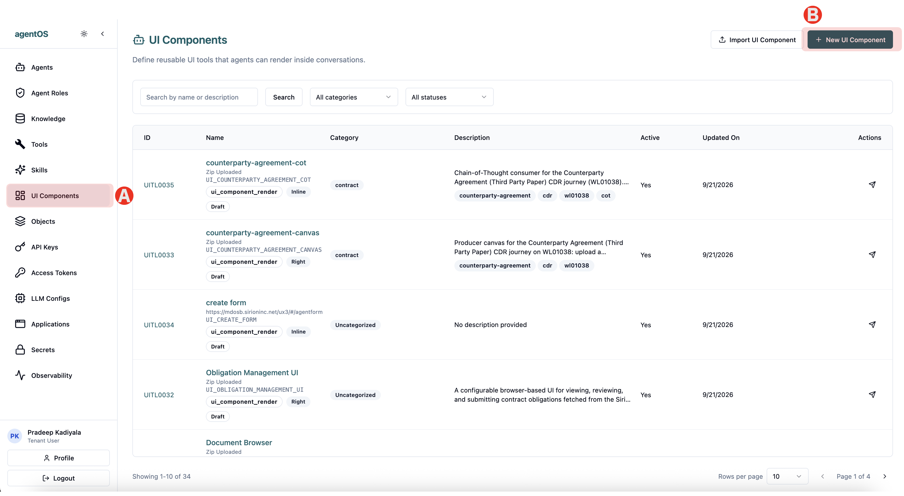
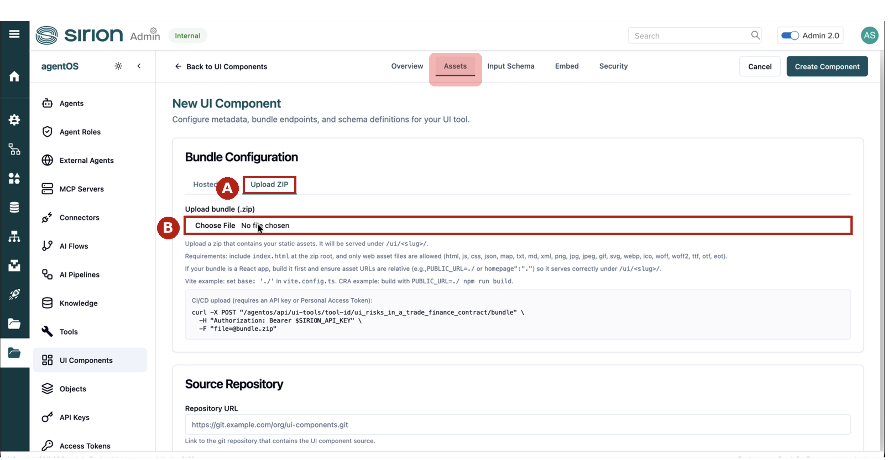
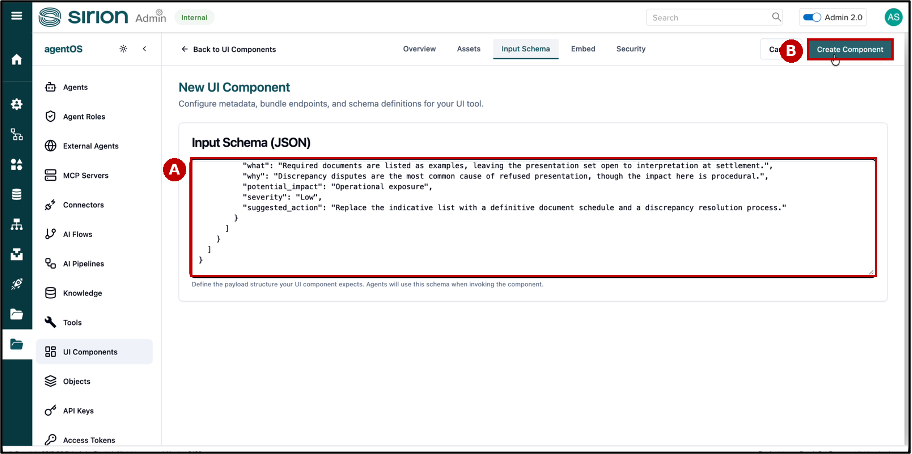
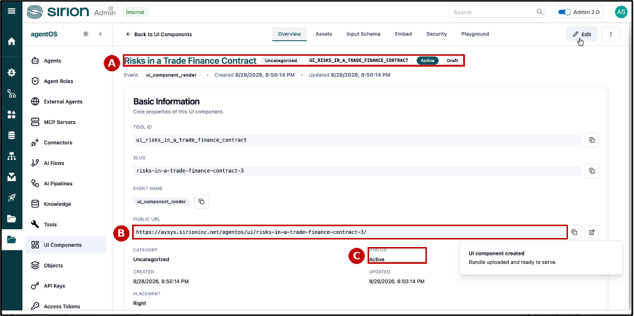
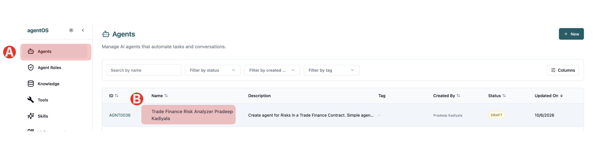
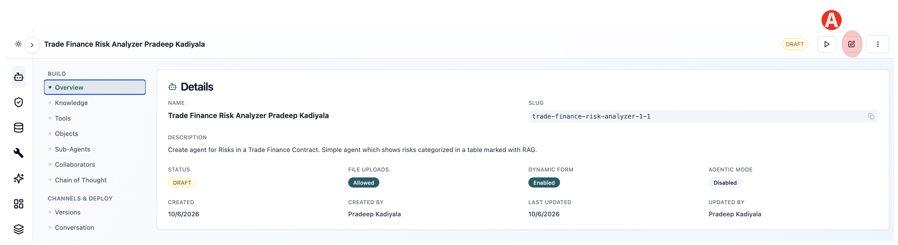
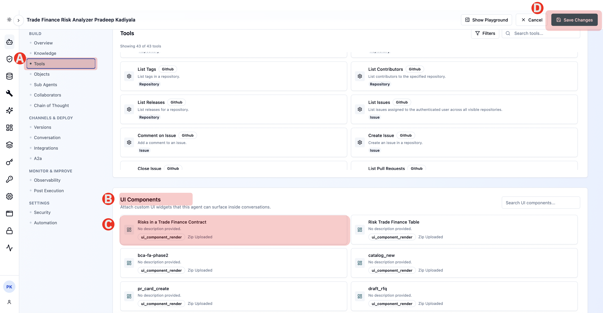
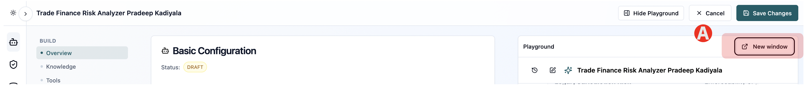
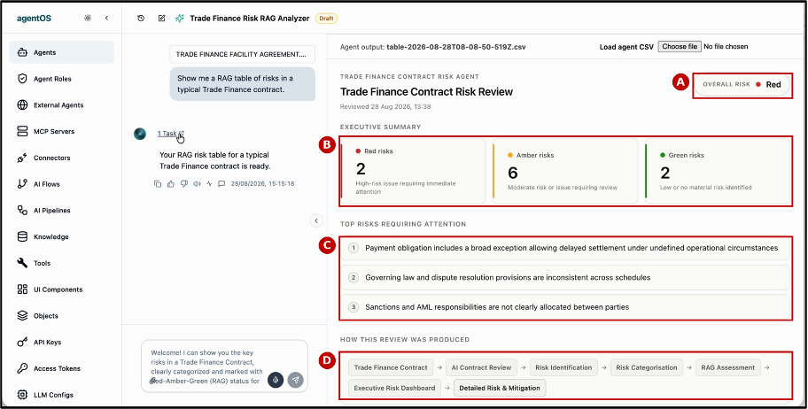

# 1.4 Implement Deterministic UI

You can give your agent a deterministic interface, but the component it renders has to exist in the environment before it can be used. A UI component is registered once, from the main navigation, and every agent in the environment can then render it. 

Steps to create Deterministic UI

## Step 1 - Create UI Component



(A) In the main navigation, click UI Components

(B) Click New UI Component

## Step 2 - Upload UI Zip file



Open the Assets tab. 

(A) Under Bundle Configuration, select Upload ZIP 

(B) Click Choose File, and select the component bundle supplied with this lab — Risks-TradeFinance-Contract-Bundle.zip

The zip must contain index.html at its root and only web asset files

> The UI Component Zip file is provided in the Pre-requisites. You can also download from here <a href="/lab1/files/RisksinTradeFinanceContract-Bundle.zip" download="Risks-Trade-Finance-Contract-UI-Component.zip">Download Risks-Trade-Finance-Contract-UI-Component.zip</a>

## Step 3 - Create Schema



Open the Input Schema tab 

(A) Paste the JSON schema that defines the payload the component expects. 

This schema is the contract between the agent and the component

(B) Click Create Component 

agentOS uploads the bundle and confirms UI component created — Bundle uploaded and ready to serve.

## Step 4 - Review the UI Component



(A) The component name, its tool ID and its state.

(B) Public URL — where the bundle is served from. Agents reach the component through this address.

(C) Status — Active. The component is now available to every agent in the environment, including the one you built.

## Step 5 - Return to the Agent



(A) Click on "Agents" on the left menu bar

(B) Click on your previously created Agent

## Step 6 - Edit the Agent



(A) Click on Edit Agent button on top right corner

## Step 7 - Add newly created UI Component



(A) Goto tools section by clicking on Tools

(B) Below Tools you will find UI Components. Scroll down if needed

(C) Find and select the newly created UI Component "Risks in a Trade Finance Contract"

(D) Save the updates to the Agent

## Step 8 - Click Show Playground


(A) Click Show Playground in the top right of the agent

## Step 9 - Run the Agent

 

(A) Click on New Window button on top right corner of the playground



Now ask the agent for the same analysis in its dashboard view

```text
Show me a RAG table of risks in a typical Trade Finance contract.
```

The agent renders the Risks in a Trade Finance Contract UI component — the same findings, presented as an executive dashboard

---

## ✅ Checkpoint

- [ ] Create Deterministic UI Component
- [ ] Test the UI Component against Agent

*Next: [1.4 Generate Agent API Key  →](lab1/05-api.md)*

