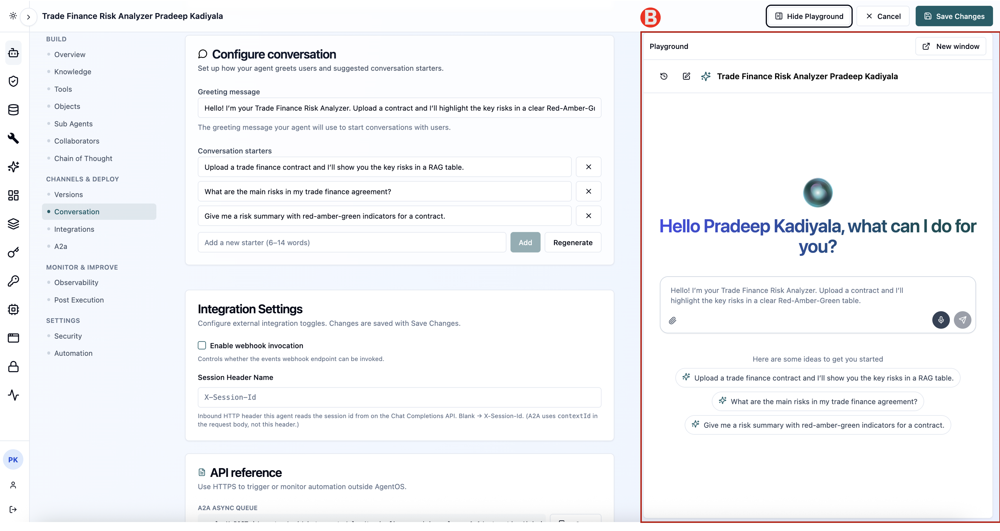
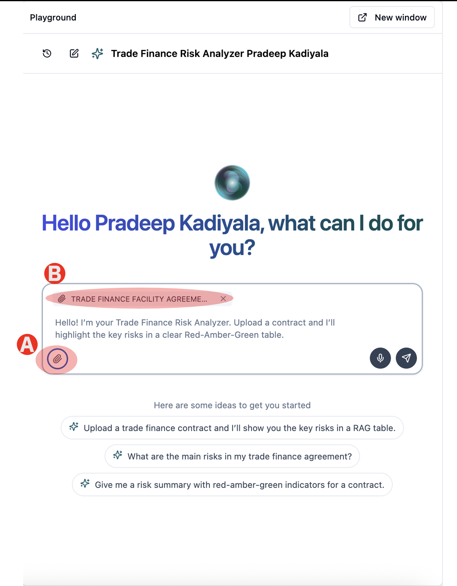

# 1.4 Run the Agent

Now run contract through the agent and read what comes back.

---

## Step 1 - Run the Agent in the playground

(A) Click Show Playground in the top right of the agent

(B) The Playground opens beside the configuration so you can test without leaving the page. Your greeting and conversation starters appear exactly as a user would see them.

## Step 2 - Upload the "Trade Finance Contract" file

(A) Under Playground panel, click the attachment icon in the message box and upload TRADE FINANCE FACILITY AGREEMENT.docx. A copy of the contract is linked in Prerequisites of this guide

> DOWNLOAD FILE: You can also download the contract file from here [TRADE FINANCE FACILITY AGREEMENT.docx](/lab1/files/TRADE_FINANCE_FACILITY_AGREEMENT_1.docx ':ignore')

(B) The file is attched to the chat box once it is uploaded

