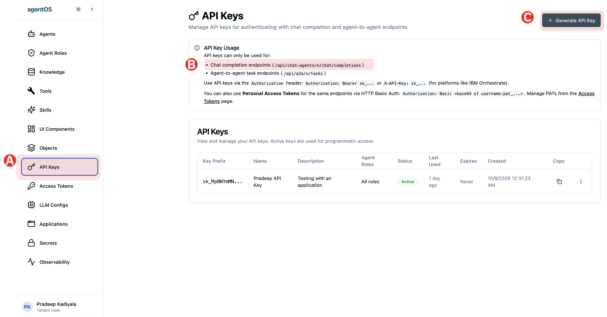
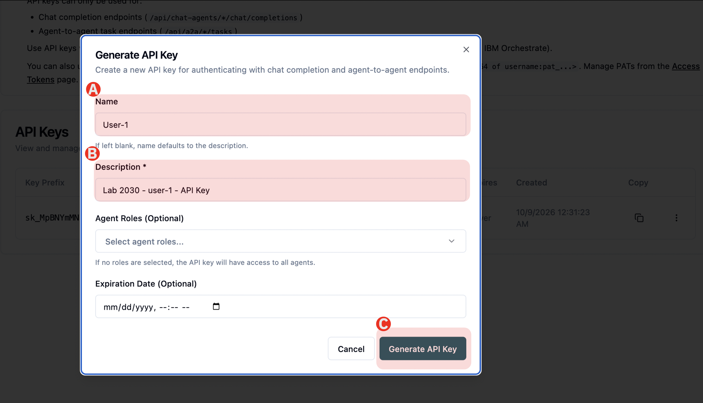
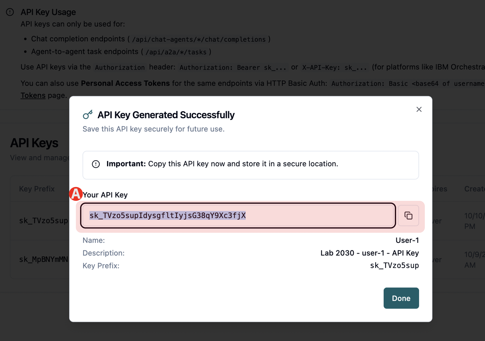

# 1.4 Generate Agent API Key

Here you will generate API Key to integrate with the Agent that you just ceated. Once you create the API token you will be using that in the next section where you will deploy an application in IBM Cloud Serverless projects

To generate API Key follow the steps

## Step 1 - Navigate to API Keys

(A) Under Main Menu click on API Keys

(B) Get the API endpoint and save it temporarily in a text file

(C) Click Generate API Key on top right corner. A dialogue box will open to Generate API Key

## Step 2 - Generate API Key

Enter the following fields

(A) - Enter a unique name (eg - yourname and company)

(B) - Give any description (eg - Which industry your company is in)

(C) - Leave rest of the fields as is and click the button "Generate API Key". 

## Step 3 - Save the API Key

(A) Copy the API Key generated and save it in a text file for the next section

> Sometimes the copy button doesnt work so manually select and copy the API Key

---

## ✅ Checkpoint

Before you got to next section make sure you save the:

- [ ] API Endpoint 
- [ ] API Key.

---

**You have successfully completed the first section "Build Agents on agentOS".**

## 🎉 Congratulations! 🎉

Now that you have created an Agent for a specific industry use case which is identifying the risks for a given contract, we will integrate this Agent with an existing Enterprise Application and deploy on IBM Cloud Serverless Project

