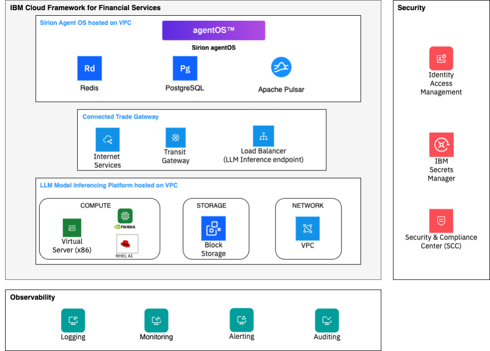
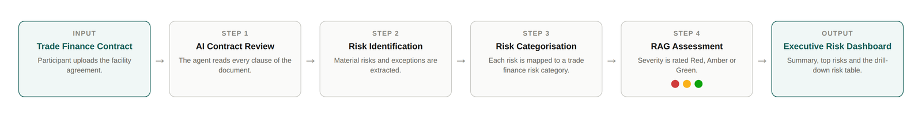
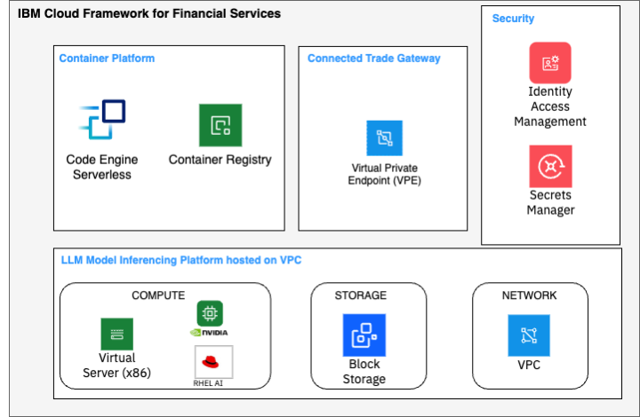
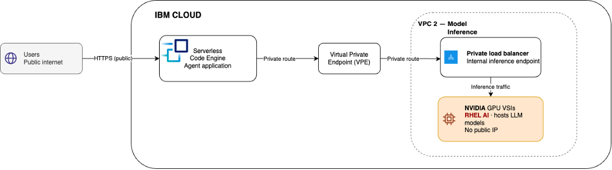

# Architecture Overview

This section describes the high-level architecture of the Trade Finance solution you will build during the labs using IBM Cloud Independent Software Vendor (ISV) Sirion Agent OS and IBM Cloud Services.

---

## Agentic AI on Sirion Agent OS

---

### Key Components

#### 1. Sirion Agent OS

Sirion is a Contract Lifecycle management software that is deployed in its on virtual private cloud (VPC). The lab uses a single agent running on agentOS. There is nothing to install and nothing to deploy — the participant works in a browser, the contract is uploaded into the agent’s Playground, and the result is rendered back into the same conversation. The parts of the agent, and what each one does:

| Component	| Purpose in this lab |
| --------- | ------------------- |
| Agent Instructions |	The system prompt. Defines the agent’s role as a trade finance contract risk reviewer, the risk categories it works with, the RAG rating rules, and how it must present findings. |
| LLM Configuration |	The model that powers the agent. A fallback model can be configured for resilience. |
| Tools |	Toolkits the agent calls to do work. The Word, PDF and Document Parser toolkits let it read the uploaded contract. |
| Knowledge Sources |	Optional reference material — websites, documents or custom data — that the agent can consult. Not required for the base lab. |
| Conversation |	The greeting and the conversation starters a business user sees when they open the agent. |
| UI Component |	A reusable interface element. “Risks in a Trade Finance Contract” renders the executive risk dashboard inside the conversation. |

#### 2. Connected Trade Gateway

Integration of the Sirion to private LLM for model inferencing is performed through connected trade gateway that manages APIs and secure the data with private network connections. This is already pre-defined and deployed with the components:

| Component |	Purpose in this lab |
| --------- |	------------------- |
| Transit Gateway |	Transit Gateway connects two VPC’s – One VPC that has Sirion Agent OS and the other is where the LLM model is hosted. Both VPC’s are connected through a managed hub privately without any public internet exposure |
| Public Load Balancer |	A Public Load Balancer that supports HTTPS and SSL offloading that will connect to Sirion Agent OS platform endpoint. It allows you to scale the instances and distributes the traffic across multiple instances for public facing applications. |
| Private Load Balancer |	Private Load Balancer distributes traffic to inference models hosted on NVIDIA GPU based Virtual Server Instances within the private network, with no exposure to public network |
| Virtual Private Endpoint Gateway |	This is required for custom Application Agents that are running on Serverless Code engine to inference the LLM models through private network with no exposure to public internet. |
| Cloud Internet Services |	This acts as firewall to Sirion Agent OS public load balancer. |

#### 3. RedHat AI Inference (Dedicated or Shared)

| Component |	Purpose in this lab |
| --------- |	------------------- |
| Compute - Virtual Server Instance (VSI) |	A nVIDIA GPU accelerated virtual server instance (VSI) running Red Hat Enterprise Linux AI Operating System. The model is hosted on the VSI instance. 4 instances are hosted and inferenced through Private Load Balancer |
| Storage – Block Storage |	Block Storage Volumes are used as boot volumes. |
| VPC Network |	A private network which is secured with Security Groups (SG) and Network Access Controls (NAC) and attached to Private Load Balancer |

---

### Data Review Flow through Agents

1. **Participants** Uploads facility agreement.
2. **Agent** reads every clause in the document.
3. **Extract** material risks and exception.
4. **Categorize** trade finance risks .
5. **Assess** severity into Red, Green or Amber.
6. **Summarize** risks on dashboard.

---

## Trade Finance Cliennt Application on IBM Cloud Code Engine

Deploying client application with Supervisor Agent into a secure production grade environment 

- Host the Application: Deploy the pre-built containerized application from the private container registry to a serverless IBM Cloud Code Engine. This deployment will inference models on private infrastructure, demonstrating strict data residency and security controls.

### Key Components

#### Container Platform

| Component |	Purpose in this lab |
| --------- |	------------------- |
| Code Engine |	IBM Cloud Code Engine is a fully managed, serverless platform that runs containerised applications without requiring any infrastructure management. Automatically scaling to zero when idle and scaling out under load |
| Container Registry |	IBM Cloud Container Registry provides a private, highly available registry for storing, managing, and securing the container images |

#### Connected Trade Gateway

| Component |	Purpose in this lab |
| --------- |	------------------- |
| Virtual Private Endpoint |	Code Engine sends requests privately into the VPC through a Virtual Private Endpoint, which forwards them to a Private Load Balancer that distributes LLM inference traffic across RHEL AI instances |

#### Security
| Component |	Purpose in this lab |
| --------- |	------------------- |
| Identity Access Management |	IBM Cloud IAM controls who and what can access resources within the IBM Cloud environment. Users, service IDs, and trusted profiles secured through fine-grained access policies built on roles and resource groups |
| Secrets Manager |	IBM Cloud Secrets Manager provides a centralised, audited vault for storing and dynamically injecting secrets |

#### LLM Model Inferencing Platform hosted on VPC
| Component |	Purpose in this lab |
| --------- |	------------------- |
| Compute - Virtual Server Instance (VSI) |	A nVIDIA GPU accelerated virtual server instance (VSI) running Red Hat Enterprise Linux AI Operating System. The model is hosted on the VSI instance. 4 instances are hosted and inferenced through Private Load Balancer
| Storage – Block Storage |	Block Storage Volumes are used as boot volumes. |
| VPC Network |	A private network which is secured with Security Groups (SG) and Network Access Controls (NAC) and attached to Private Load Balancer |

### Model Inferencing Workflow

The workflow describes an Agent on a serverless IBM Cloud Code Engine that will inference the private hosted LLM through a secure VPE endpoint gateway. This ensures that there is no public access to private LLMs and securing user data.

*Next: [Lab 1 — Accessing IBM Cloud →](../lab1/01-ibm-cloud-access.md)*
